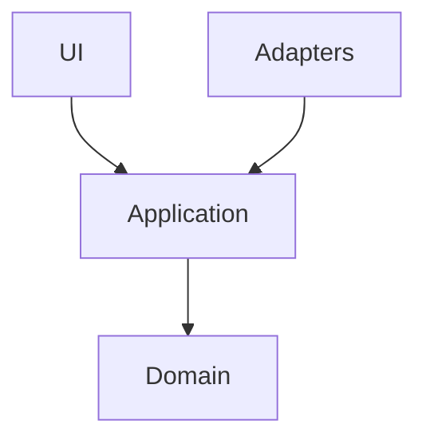

# Copilot Instructions

## Project Overview

This repo serves two purposes:
1. **Geodata source** — 68 reciprocal yacht clubs for Sloop Tavern Yacht Club (STYC), with `data/clubs.geojson` as the authoritative source (KML, CSV, JSON are derived exports)
2. **Next.js 19 web app** — an interactive map and club directory built on top of that data

Data is sourced from [yachtdestinations.org](https://yachtdestinations.org) and the original `data/STYC_Reciprocal_Clubs.kml`.

## Commands

```sh
# Validate GeoJSON against the expected club list
node validate.js

# Regenerate KML from GeoJSON
node geojson-to-kml.js

# Lint all Markdown files
npx markdownlint-cli "**/*.md" --ignore node_modules

# Run all tests with coverage
npx vitest run --coverage

# Run a single test file
npx vitest run src/path/to/foo.test.ts
```

## Architecture

`clubs.geojson` is the single source of truth. Everything else is derived:

```
clubs.geojson  →  geojson-to-kml.js  →  clubs.kml
               →  (manual export)    →  clubs.csv
```

`validate.js` compares `clubs.geojson` against a hardcoded reference list of 68 clubs scraped from the website details page. It reports clubs present in one source but not the other.

The `src/` directory will contain the Next.js app following hexagonal architecture (see Tech Stack below).

## Data Conventions

- **Coordinate order**: GeoJSON standard `[longitude, latitude]` (not lat/lon)
- **Club count**: Exactly 68 active reciprocal clubs in the curated dataset (`clubs.json` and `clubs.csv` contain 175 total clubs including non-reciprocal)
- **Distance unit**: Nautical miles (`distance_nm`) from Seattle
- **Phone format**: E.164-style, e.g. `+1 360-293-5277`
- **Regions**: 16 predefined regions (e.g. `"Northern Inland Waters"`, `"Puget Sound South"`, `"Vancouver Area"`) — don't invent new region names

## GeoJSON Feature Schema

```json
{
  "type": "Feature",
  "properties": {
    "name": "Anacortes Yacht Club",
    "region": "Northern Inland Waters",
    "distance_nm": 58,
    "website": "http://www.anacortesyachtclub.org",
    "address": "611 T Ave, Anacortes, WA 98221",
    "phone": "+1 360-293-5277"
  },
  "geometry": {
    "type": "Point",
    "coordinates": [-122.605, 48.5125]
  }
}
```

All 68 features must have valid coordinates, a website, and contact info. Run `node validate.js` after modifying club data.

## Tech Stack

### Next.js 19
- App Router with React Server Components
- Use the `next-best-practices` skill for RSC boundaries, async params/cookies, data patterns, error handling, metadata, and image optimization
- `params` and `searchParams` are async — always `await` them
- Default to Node.js runtime (not Edge) unless there's a specific reason

### Styling: Panda CSS + Ark UI
- **No Tailwind.** All styling via Panda CSS only.
- Use the `panda-css` skill for comprehensive API docs (fetch `https://panda-css.com/llms-full.txt` for full reference)
- Style with `css()` for one-off styles, `cva` recipes for multi-variant components
- Use Panda CSS patterns (Stack, Flex, Grid, Container) for layout primitives
- Ark UI provides headless, accessible components — style them with Panda CSS recipes, not inline styles
- Design tokens live in `panda.config.ts`; use semantic tokens for light/dark mode

### MapLibre GL JS
- MapLibre is a client-side library — map components must be `'use client'`
- Load GeoJSON from `data/clubs.geojson` as a map source; use symbol/circle layers for club markers
- Never import MapLibre in Server Components; use dynamic imports with `ssr: false` if needed:
  ```ts
  const Map = dynamic(() => import('@/components/Map'), { ssr: false })
  ```
- Club coordinates are `[longitude, latitude]` (GeoJSON standard) — MapLibre expects this order

## Architecture

### Hexagonal Architecture (Ports & Adapters)
Keep the domain logic independent of frameworks, UI, and infrastructure:

```
src/
  domain/        # Pure business logic, no framework imports
  application/   # Use cases / ports (interfaces the domain exposes)
  adapters/      # Implementations: Next.js, MapLibre, API clients, data loaders
  ui/            # React components (thin — delegate to application layer)
```

- Domain code must not import from `next`, `maplibre-gl`, or any adapter
- Adapters implement ports defined in `application/`
- UI components call use cases, not domain logic directly

### Diagrams
Use MermaidJS for all architectural diagrams. Embed in markdown:

````md

````

### Architectural Decision Records (ADRs)
Document significant decisions in `docs/adr/`. File format: `NNNN-title-in-kebab-case.md`

```md
# NNNN. Title

**Date:** YYYY-MM-DD  
**Status:** Proposed | Accepted | Deprecated | Superseded

## Context
## Decision
## Consequences
```

Create a new ADR for: framework/library choices, architectural patterns, data flow decisions, and any reversal of a prior decision.

## Styling Conventions

- **Theme**: follows system `prefers-color-scheme` — no manual toggle unless explicitly requested
- Semantic tokens in `panda.config.ts` must define both `_light` and `_dark` values
- Never hardcode color values; always reference design tokens

## Testing

- **Target**: 80% coverage across statements, branches, functions, lines — enforced in CI
- Test files co-located with source: `foo.ts` → `foo.test.ts`
- Coverage output in lcov format for SonarQube ingestion

## CI/CD

### Branching & Commits

Branch names follow conventional branching:
```
<type>/<short-description>
feat/club-map-view
fix/marker-tooltip-overflow
chore/upgrade-maplibre
docs/adr-hexagonal-architecture
```

Commit messages and PR titles follow [Conventional Commits](https://www.conventionalcommits.org/):
```
<type>(optional scope): <description>

feat(map): add cluster markers for dense regions
fix(theme): respect prefers-color-scheme on first load
chore(deps): upgrade maplibre-gl to 4.x
docs(adr): record decision to use Ark UI
test(domain): add club filtering unit tests
```

Types: `feat`, `fix`, `docs`, `style`, `refactor`, `test`, `chore`, `perf`, `ci`  
Breaking changes: append `!` after type, e.g. `feat(api)!: rename club endpoint`

PRs are **squash-merged** — the squashed commit title becomes the canonical commit message and must be a valid Conventional Commit. Individual commits within a PR branch don't need to follow the convention.

### Releases & Changelog

[semantic-release](https://semantic-release.gitbook.io/) runs on merge to `main` and automatically:
- Determines the next semver version from commit types (`feat` → minor, `fix` → patch, `!` → major)
- Generates / updates `CHANGELOG.md`
- Creates a GitHub Release with release notes

Do not manually edit `CHANGELOG.md` or bump `version` in `package.json` — semantic-release owns both.

### GitHub Actions
All CI runs on GitHub Actions (`.github/workflows/`). Every PR must pass CI before merge. Standard pipeline:

1. **lint** — markdownlint on all `**/*.md`, ESLint on app code
2. **test** — Vitest with coverage; fail if below 80%
3. **build** — `next build`
4. **deploy** — Netlify deploy (preview on PR, production on merge to `main`)

### Code Quality
- **DeepSource** (`.deepsource.toml`) — static analysis for JavaScript/TypeScript; fix all autofix issues before merging
- **SonarQube** — code quality and security scanning; address any "Blocker" or "Critical" issues before merging; coverage report is fed from Vitest's lcov output

Both tools run as GitHub Actions checks. Don't suppress their findings with inline ignore comments without a code comment explaining why.

## Deployment

- **Platform**: Netlify
- Set `output` in `next.config.ts` appropriately for Netlify's Next.js runtime
- Environment variables go in `.env.local` (local) and Netlify UI (production) — never committed

## Module System

- **ESM throughout** — use `import`/`export` in all app code
- The legacy data scripts (`validate.js`, `geojson-to-kml.js`) are CommonJS; do not import them from app code
