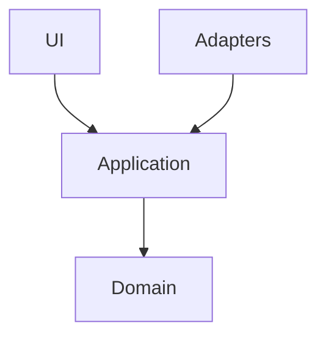

# Reciprocal Clubs

This repository serves two purposes:

1. It is the authoritative geodata source for **68 active reciprocal
   yacht clubs** for Sloop Tavern Yacht Club (STYC).
2. It is the home of a **Next.js 19 web app** that will provide an
   interactive club directory and map on top of that data.

The authoritative dataset is `data/clubs.geojson`. Other formats such as
KML, CSV, and JSON are derived exports.

## Current status

The repository now includes a working Next.js + TypeScript scaffold with
an initial vertical slice:

- hexagonal folder structure (`domain`, `application`, `adapters`, `ui`)
- GeoJSON adapter and application use case pipeline
- initial synchronized list + map route (`/`)
- Panda CSS toolchain and generated style artifacts
- Vitest baseline tests for domain and application behavior

## Data source of truth

`data/clubs.geojson` is the single source of truth for reciprocal club records.

```text
data/clubs.geojson  ->  geojson-to-kml.cjs  ->  data/clubs.kml
                    ->  manual export      ->  data/clubs.csv
                    ->  derived export     ->  data/clubs.json
```

Each feature includes:

- club name
- region
- distance from Seattle in nautical miles
- website
- address
- phone number
- point coordinates in GeoJSON order: `[longitude, latitude]`

## Current commands

Primary commands:

```sh
# Start the Next.js app
npm run dev

# Build a production bundle
npm run build

# Lint app code
npm run lint

# Run test suite
npm run test

# Run tests with coverage
npm run test:coverage

# Validate GeoJSON against the expected club list
npm run validate:data

# Regenerate KML from GeoJSON
npm run export:kml

# Lint all Markdown files
npx markdownlint-cli "**/*.md" --ignore node_modules
```

## Available data files

| Format | File | Purpose |
| --- | --- | --- |
| GeoJSON | `data/clubs.geojson` | Authoritative mapping dataset |
| KML | `data/clubs.kml` | Google Earth and other KML consumers |
| JSON | `data/clubs.json` | Derived structured export |
| CSV | `data/clubs.csv` | Spreadsheet-friendly export |
| KML (original) | `data/STYC_Reciprocal_Clubs.kml` | Legacy source reference |
| CSV (original) | `data/STYC_Reciprocal_Clubs.csv` | Legacy source reference |

## Dataset conventions

- **Club count**: exactly 68 active reciprocal clubs in the curated dataset
- **Coordinates**: GeoJSON-standard `[longitude, latitude]`
- **Distance**: stored as `distance_nm`
- **Phone format**: E.164-style strings such as `+1 360-293-5277`
- **Regions**: use the existing 16 region names from the dataset; do
  not invent new names casually

### Regions in the curated dataset

- BC Islands
- Columbia River
- Columbia River OR
- Hawaii
- Inside Passage Alaska
- New Zealand
- Northern California
- Northern Inland Waters
- Olympic & Hood Canal
- Portland Area
- Puget Sound North
- Puget Sound South
- Seattle Area
- Southern California
- Vancouver Area
- Whidbey & Everett

## GeoJSON schema

```json
{
  "type": "Feature",
  "properties": {
    "name": "Anacortes Yacht Club",
    "region": "Northern Inland Waters",
    "distance_nm": 58,
    "website": "http://www.anacortesyachtclub.org",
    "address": "611 T Ave, Anacortes, WA 98221",
    "phone": "+1 360-293-5277"
  },
  "geometry": {
    "type": "Point",
    "coordinates": [-122.605, 48.5125]
  }
}
```

## Planned application stack

The app is built with:

- **Next.js 16** with the App Router and React Server Components
- **Panda CSS** for all styling
- **Ark UI** for accessible headless primitives
- **MapLibre GL JS** for interactive mapping
- **Netlify** for deployment

Important implementation constraints:

- No Tailwind
- App code should use ESM `import`/`export`
- MapLibre stays in client components only
- Theme follows system `prefers-color-scheme`

## Architecture

The app will follow a hexagonal architecture so domain logic stays
independent from Next.js and UI details.



Current structure:

```text
src/
  domain/
  application/
  adapters/
  ui/
```

- `domain/` contains pure business logic
- `application/` contains use cases and ports
- `adapters/` contains implementations for Next.js, data loading, and
  mapping integration
- `ui/` contains thin React components

## Quality and delivery conventions

- Tests should target **80% coverage** across statements, branches,
  functions, and lines
- Markdown is linted with `markdownlint`
- CI/CD runs on **GitHub Actions**
- Code quality is enforced with **DeepSource** and **SonarQube**
- Pull requests follow **Conventional Commits** and **conventional
  branching**
- PRs are **squash-merged**
- Releases and changelog generation are handled by **semantic-release**

## Architectural decisions

Significant architectural and tooling decisions should be recorded as
ADRs in `docs/adr/` using numbered kebab-case filenames such as:

```text
docs/adr/0001-hexagonal-architecture.md
```

Use MermaidJS for architectural diagrams in ADRs and other project documentation.

## Data sources

Primary upstream references:

- [yachtdestinations.org](https://yachtdestinations.org)
- `data/STYC_Reciprocal_Clubs.kml`
- `data/clubpage.php?page=dt&club=63&account=72d331c5905e1bbe51588b9a2fba0487&css=default&hash=&title=yes&width=default&height=default`

## License

MIT for repository code and configuration. Source data remains subject
to the upstream website's terms of use.
