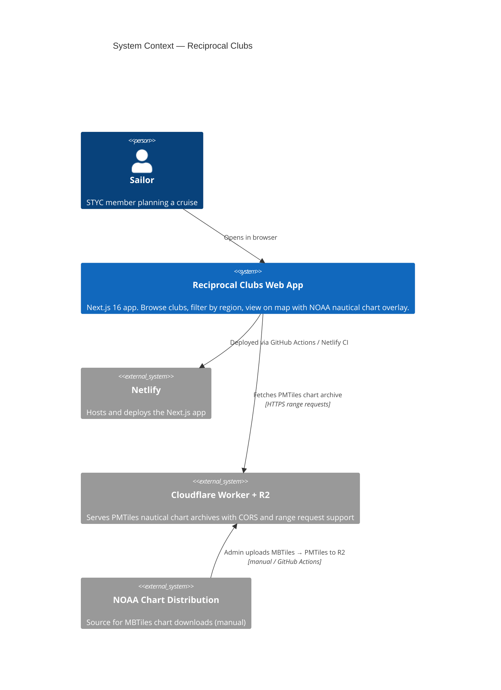
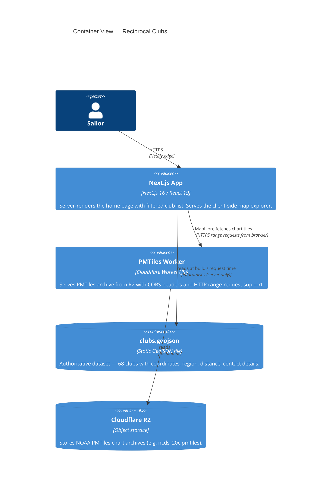
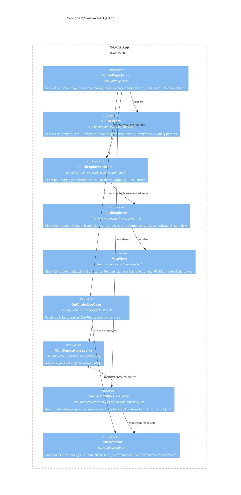
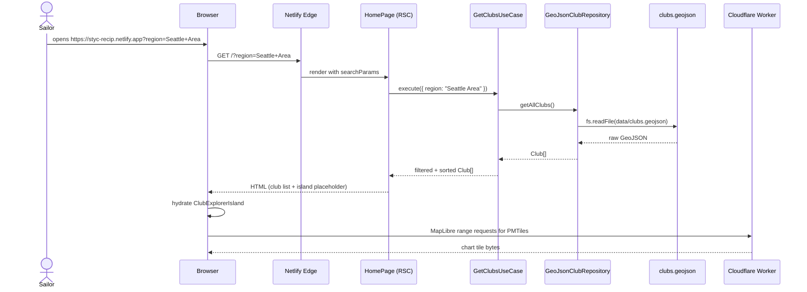
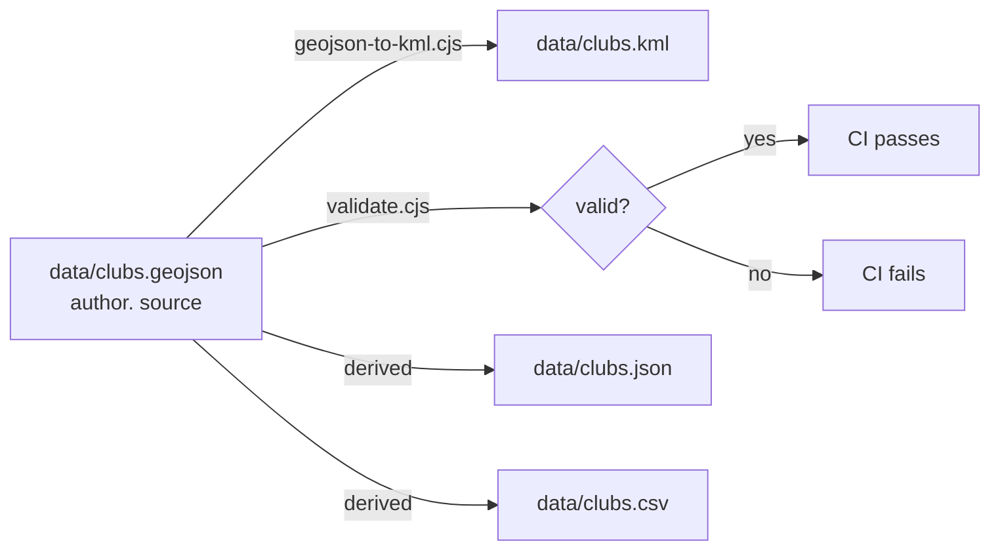
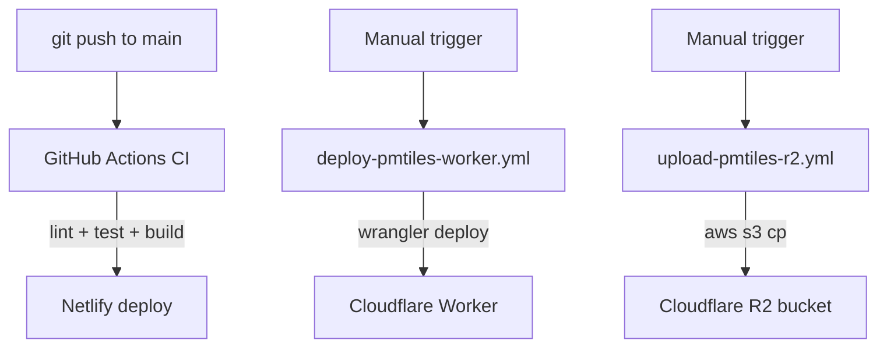

# Architecture

This document describes the structure of the Reciprocal Clubs application using
the [C4 model](https://c4model.com). All diagrams use MermaidJS.

---

## Level 1 — System context

The Reciprocal Clubs system lets sailors browse and filter STYC's 68 reciprocal
yacht clubs on an interactive map. It consists of a Next.js web app served from
Netlify and nautical chart tiles served from a Cloudflare Worker backed by R2.

---

## Level 2 — Container view

The system has two runtimes: the Next.js app (on Netlify) and the Cloudflare
Worker. Data lives in the repository as static files; there is no runtime database.

---

## Level 3 — Component view (Next.js app)

The app follows **Hexagonal Architecture** (Ports & Adapters). Dependencies always
point inward toward the domain; no outer layer imports an inner layer's concrete
types directly.

---

## Data flow — page load

---

## Data pipeline — club data

---

## Deployment pipeline

---

## Clean Architecture layer mapping

| Layer | Directory | Rule |
| --- | --- | --- |
| Entities | `src/domain/` | Pure TypeScript — no framework imports |
| Use Cases | `src/application/use-cases/` | Depends only on domain and ports |
| Interface Adapters | `src/adapters/`, `src/app/` | Implements ports; may import Next.js |
| Frameworks & Drivers | `src/ui/`, `styled-system/` | React, MapLibre, Panda CSS |

---

## Architecture decisions

See [`docs/adr/`](adr/) for all recorded decisions:

| ADR | Decision |
| --- | --- |
| [0001](adr/0001-hexagonal-architecture.md) | Hexagonal Architecture |
| [0002](adr/0002-nextjs-app-router.md) | Next.js App Router |
| [0003](adr/0003-panda-css-and-ark-ui.md) | Panda CSS + Ark UI |
| [0004](adr/0004-maplibre-for-interactive-map.md) | MapLibre GL JS |
| [0005](adr/0005-netlify-deployment-target.md) | Netlify hosting |
| [0006](adr/0006-nautical-chart-basemap.md) | NOAA nautical chart basemap |
| [0007](adr/0007-cloudflare-r2-worker-for-pmtiles-delivery.md) | Cloudflare R2 + Worker for PMTiles |
